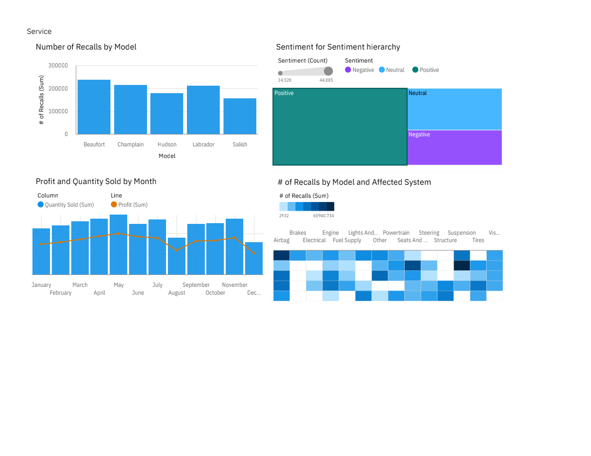

# Automotive Sales & Service Quality Dashboard 🚗📊

## 📌 Project Overview
This project provides an end-to-end analysis of an automotive business, bridging the gap between revenue generation and product reliability. Using **IBM Cognos Analytics**, the dashboard explores dealer sales performance alongside critical post-sale metrics, including vehicle recalls and customer sentiment.

## 🛠️ Tools & Technologies Used
* **Data Visualization & BI:** IBM Cognos Analytics
* **Analytics Focus:** Sales Tracking, Quality Assurance (Root-cause analysis), Sentiment Analysis

## 🗂️ Key Metrics & Dimensions Analyzed
* **Sales Data:** `Profit`, `Quantity Sold`, `Dealer ID`, `Model`, `Month`
* **Service & Quality Data:** `Number of Recalls`, `Affected System` (e.g., Airbag, Brakes, Engine)
* **Customer Experience:** `Sentiment` (Positive, Neutral, Negative)

## 💡 Key Business Insights
1. **Sales vs. Volume:** Tracked total profit ($78.3M) and quantity sold (58K+ units) across different models and dealers to identify top-performing retail partners.
2. **Time-Series Performance:** Analyzed the relationship between quantity sold and profit month-over-month to spot seasonal trends.
3. **Service & Risk Analysis (The "Why"):** Mapped out vehicle recalls by model (e.g., Beaufort, Champlain) and isolated the specific affected systems (Airbag, Powertrain, Brakes). This provides actionable data for the manufacturing and quality assurance teams.
4. **Voice of the Customer:** Integrated a sentiment analysis hierarchy to correlate product quality issues with overall customer satisfaction.

## 🔗 View the Project
* **Dashboard Screenshot:** 

---
*This project highlights my ability to use enterprise-grade BI tools to connect sales data with operational quality metrics.*
